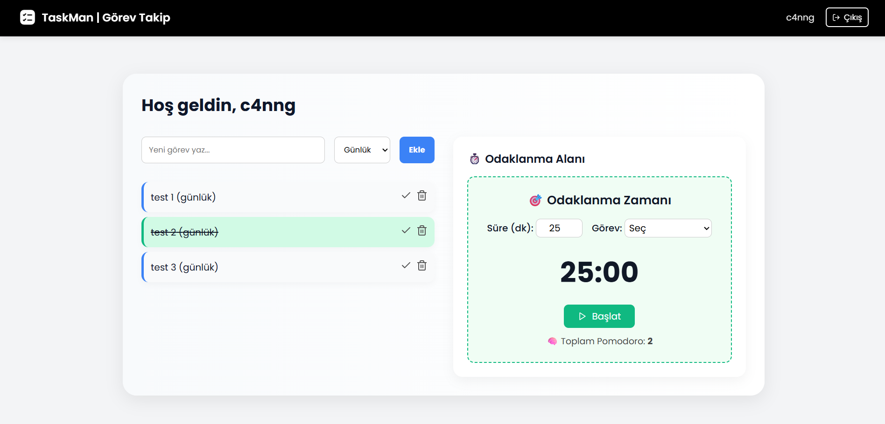

# 📋 TaskMan – Pomodoro Destekli Görev Takip Uygulaması

**TaskMan**, görev yönetimi ve Pomodoro tekniğini bir araya getiren modern, hafif ve kullanıcı dostu bir web uygulamasıdır.  
React + Flask mimarisi ile geliştirilmiştir.

---

**Not**, Frontend ve Backend klasörlerinde projenin saf kaynak kodlarını bulabilirsiniz build edilmiş versiyon **TaskMan-Build** klasöründedir.

---
## 🚀 Özellikler

- 🧍‍♂️ Kullanıcı kayıt ve giriş sistemi
- 🗓️ Günlük ve haftalık görev tipi desteği
- ✅ Görev tamamlama, silme ve listeleme
- ⏱️ Pomodoro zamanlayıcı (mola destekli, otomatik geçişli)
- 🔔 Bildirim ve 🔊 sesli uyarı
- 🎉 Tamamlanan Pomodoro sonrası konfeti efekti
- 📊 Görev başına Pomodoro takibi
- 🧠 Toplam odaklanma sayısı (localStorage ile)
---



---

## 👨‍💻 Geliştirici

**Enes Can Adil**  
💻 Python, React, Flask, Siber Güvenlik  
🌍 Türkiye

🔗 GitHub: [github.com/c4nng](https://github.com/c4nng)  
✉️ E-posta: ecan8320@gmail.com  
📌 LinkedIn: [linkedin.com/in/c4nng](https://linkedin.com/in/c4nng)

---

# 🚀 TaskMan – Build Sürümü Nasıl Çalıştırılır?


Bu versiyon, **TaskMan** uygulamasının sadece çalıştırmaya hazır olan build edilmiş halidir.  
React frontend `dist/` klasöründe yer alır ve Flask backend tarafından otomatik sunulur.


---

## ▶️ Nasıl Çalıştırılır?

### 1. Python ile çalıştır:

```bash
python app.py
```
### 2. Uygulamaya eriş

```bash
http://localhost:5000
```


